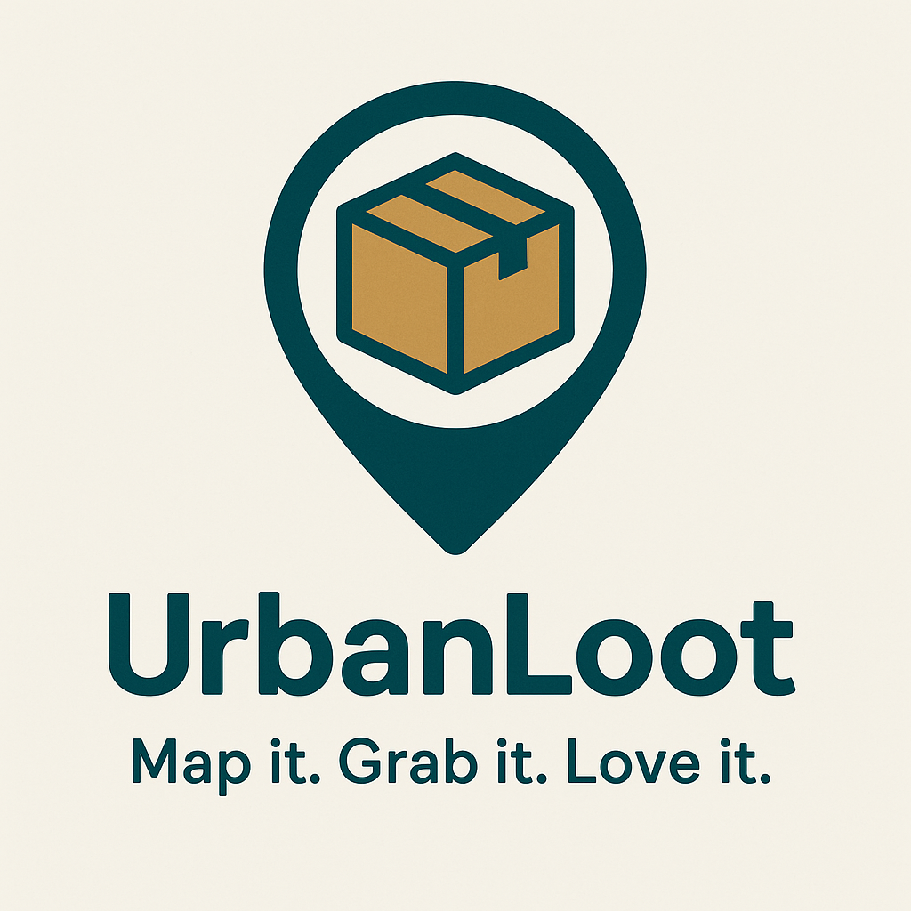

<div align="center">
  
</div>


# Urban Loot Mobile App

Urban Loot is a mobile application that helps users find abandoned objects nearby, encouraging recycling and sustainable reuse. By connecting people with abandoned items, the app contributes to a cleaner environment and promotes eco-friendly practices.

## How It Works

The platform is built using a microservices architecture to ensure scalability and efficiency. Each service is responsible for a distinct functionality:

- **User Service:** Manages user authentication, profiles, and preferences.
- **Object Service:** Handles reporting, geolocation, and managing abandoned objects.
- **Notification Service (N/A):** Sends alerts and updates to users about new nearby objects.
- **Analytics Service (N/A):** Monitors user interactions and provides insights for future improvements.

The microservices communicate over RESTful APIs and/or message queues, making it easier to update, scale, and maintain individual components without affecting the entire system.

## Running the Application

### Prerequisites

- Node.js and Yarn installed

### Installation

Clone the repository and install dependencies:

```bash
$ git clone http...
$ cd urbanloot
$ yarn install
```

### Development Mode

Run each microservice separately. For example, in different terminal windows:

```bash
# Start Users Service
$ yarn run start:users

# Start Authentication Service
$ yarn run start:auth

# Start Api Gateway Service
$ yarn run start:gateway

# To Start All Ms at once
$ yarn start:all
```